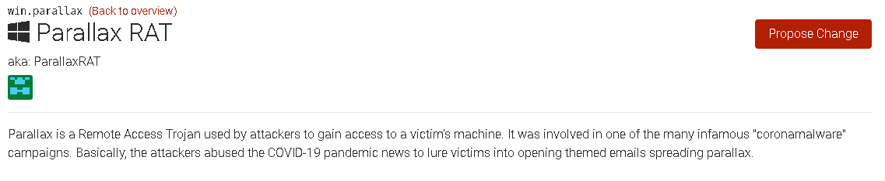
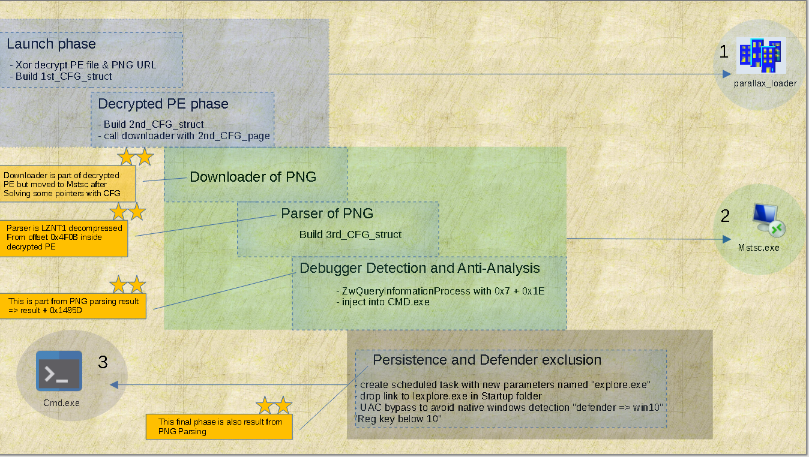

# summary :-

the SHA-256 of the loader sample is ```5DBC5B3553CDD5DF896629CD10A614CF1C384CFAFFFB0754898EE870589F5A10```

it said [that](https://malpedia.caad.fkie.fraunhofer.de/details/win.parallax) parallax RAT is one of infamous Malwares that spread during Covid-19 pandemic, as malpedia write about it 




in this blog Post we are not going to dive into the main RAT payload, instead we will focus in the loader stage and see how the loader preparing to launch the payload in low-detected and evasive way ... as it also [said](https://twitter.com/malwrhunterteam/status/1227196799997431809) that it detected by only one Engine in "Virus Total" when it submitted for the 1st time.

**another thing to note** this analysis blogpost isn't intended to give any threat intel information's, it will be something like tracing how I as beginner approach the analysis process and digging into internals of my first malware sample, trying to figure out how malicious functionality is implemented . 


# Execution Flow :-



the most special aspect about this loader is it very obfuscated an stealthy as we will dissect it now to see how it does this ...

the loader isn't embedded  the RAT payload  directly inside itself because it will be an easy hunt for any static-based detection to catch it, so it encode the payload inside a PNG image hosted at `Imgur{.}com` and  as part of it's execution it will download this PNG file and decode the payload from it.

__________________________________

### we can roughly divide execution flow as stages :-

- Preparation stage => "launch, decryption and inject into Mstsc.exe-prepare downloader-" 
- Downloader stage => download the PNG from `imgur` to `%TMP%`
- Parser stage  =====> decode the PNG to produce the next 2 stages code 
- Anti-Debugging  ===> anti-debugging by `ZwQueryInformationProcess()` - detect AV product by `NtQuerySystemInformation()` 
- Persistence   =====> establish Persistence and exclude the final Payloads from Defender detection 

### and to get a sense of the big picture of the execution flow, we need to know  pieces that build this full picture

1- `Decrypted PE file` => which is simply "xor decrypted"  data_blob to code contains

	a - PE File ->  prepare downloader and build `2nd_CFG_struct` -will be explained-
	b - shellcode -> responsible for image downloading stage 

2-  `1st_CFG_struct` , `2nd_CFG_struct` and `3rd_CFG_struct` those are internal structures that every stage responsible to build and handover it to the next stage, and the whole point of this is obfuscation, this structs is containing 

- win API addresses 

-  Boolean values that control the flow 

- constant used during decompression or to access offsets

- Pointers and offsets inside the loader itself 

- executable names used as target for injection of the payload

and Definitions for those structures is showed in the following figures 

  

  


**note** => the shellcode responsible of downloading PNG is the second member of ```_2nd_CFG_struct``` 

​         => the loader relay heavily to call ```ZwDelayExecution``` which is at offset ```0x24```here - so during analysis we ```*NOP slide*``` this API itself inside virtual memory of 				ntdll.dll itself 


and if we go for analysis without previous build of these structures `1st_CFG_struct` , `2nd_CFG_struct` and `3rd_CFG_struct`  we will face something like this :- 


before appling structres.


but after those structure applied :-


------

so now we know the stages of execution and the internal structures used by these stages, let's poke inside each stage of them 

~~~~
~~~~

## **A_) Preparation stage :- "two part ( 1-preparation &  2-decrypted)"**

### Part1 => preparation

``` this part is contains how next stage code and url decrypted and moving execution with function pointer```

the first thing it does is to XOR decryption of code that prepare `2nd_CFG_struct` and also code responsible for Downloader part, this decryption is done with hardcoded Dword key 


the same thing is done for decryption of PNG URL, and also calling offset inside decrypted PE which is responsible for Building `2nd_CFG_struct` and calling the downloader passing to it the builded  struct ... **something worth mentioning here** the method of moving execution to shell code with function Pointer is less noisy than spawning another thread or injection because the shellcode here is doing a small job so this method is suitable for this situation


after this we will move to 

### part2 => Decrypted

``` 
- how API procedures resolved in runtime by hashing.
- how malware map a second ntdll.dll from disk. 
- removing userland AV hooks.
- mixing 64-bit\32-bit code using heaven gates && how malware know the ssdt number without hardcode them "ssdt isn't fixed number across windows versions".
- how the malware inject into remote process using ( write - change entry - resume) style.
```

---

### =>   API resolving at runtime    ###

---

the malware resolve an API used in execution by these steps 

1. get the library base address by traversing PEB "Process environment Block" structure
2. pass CRC32 hash to resolving function that walk through all exports by dll and compare them against hash
3. after selecting the matching name of exported API, it will go through EOT "ordinals table" and EAT"addresses table" to get the address
4. storing the address of API in Stack Variable "local" {EBP-XXX} ... to obfuscate calls issued during execution
5. get SSDT number "system service descriptor table" "syscall table" for some of those APIs, to use them in "Heaven's gate" technique that will be explained later.

first thing the malware get PEB address of the current module, then it get the ```struct _PEB_LDR_DATA``` member inside PEB which hold this structure 

```c
 struct _PEB_LDR_DATA 
{ 
 ULONG Length; 
 BOOLEAN Initialized;  
 PVOID SsHandle; 
 LIST_ENTRY InLoadOrderModuleList; // +0x0c 
 LIST_ENTRY InMemoryOrderModuleList; // +0x14 
 LIST_ENTRY InInitializationOrderModuleList;// +0x1c 
} PEB_LDR_DATA; 
```


this structure where the malware can get the base address for example of Ntdll.dll, it will find this in any of the 3 "double linked list" => `InLoadOrderModuleList , InMemoryOrderModuleList and  InInitializationOrderModuleList` the only difference between them is the offset that the malware author choose to travel with :smile: and when he choose any of those 3 structures it will have a pointer `flink` which point to member on the "double linked list" of `_LDR_MODULE` structure  and from dereferencing this `flink` and access offsets inside  `_LDR_MODULE` 

```c++
struct _LDR_MODULE{ 
LIST_ENTRY          InLoadOrderModuleList;    
LIST_ENTRY          InMemoryOrderModuleList;   
LIST_ENTRY          InInitializationOrderModuleList; 
void*               BaseAddress; //0x18  
void*               EntryPoint;    
ULONG               SizeOfImage; 
UNICODE_STRING      FullDllName; 
UNICODE_STRING      BaseDllName; //0x2C
ULONG               Flags; 
SHORT               LoadCount; 
SHORT               TlsIndex; 
HANDLE              SectionHandle; 
ULONG               CheckSum; 
ULONG               TimeDateStamp; 
} LDR_MODULE;
```

so here the malware author choose to go with `InLoadOrderModuleList` . 

and the Pseudo-code to implement `get_base_of_dll( str dll_CRC32_hash )` is the following :-

- get PEB_address => `PEB = FS[30h]`  , `PEB = TIB[30h]`                  
-  go to `_PEB_LDR_DATA` => `LDR = PEB[0xC]` => author go for `LoadOrderModuleList`
-  go to Flink => `Flink = LDR[0xC]`                                    
-  loop through all linked list and get `BaseDllName`  => `Name = Flink[0x2C]`                                 
-  compare CRC32 hash of the current `BaseDllName`  with one supplied as argument =>  `if( CRC32hash(BaseDllName) == supplied_hash)`        
-  get the `BaseAddress` in `_LDR_MODULE` with matched  `matched_Flink[0x18]`                                  
-  otherwise - not matched - , continue loop linked list                                                                

and the C code implementation 

```c
int get_base_of_dll( int dll_CRC32_hash ){ 
    *PEB = NULL, 
    *Ldr_struct = NULL, 
    *Flink_ptr = NULL, 
    *p = NULL, 
    *BaseAddress = NULL, 
    *DllName = NULL; 
 
  __asm 
  { 
    mov eax,fs:[0x30] 
    mov PEB,eax 
  } 
  Ldr_struct = *( ( void ** )( ( unsigned char * )PEB+0x0c ) ); 
  Flink_ptr = *( ( void ** )( ( unsigned char * )Ldr_struct+ 0x0c ) ); 
  flink_iterator = Flink_ptr; 
  do
  { 
    
    DllName = *( ( void ** )( ( unsigned char * )flink_iterator+ 0x2C ) ); 
    if( CRC32Hasing(DllName) == dll_CRC32_hash ){
    		BaseAddress = *( ( void ** )( ( unsigned char * )flink_iterator+ 0x18 ) ); 
			};
    
    flink_iterator = *( ( void ** )flink_iterator); 
  } 
  while ( Flink_ptr != first_one ); 
  return BaseAddress; 
} 
```

and in the Hex-Ray's De-compiler  after adding required structures and fixing pointers, we could see the `get_base_of_dll()`  match what we explained so far :-

 

and it does this for getting the base address for `ntdll.dll , kernel32.dll` as the malware is only depend on low level APIs


now with the two dll Base Address it will then move to resolving APIs, then store them in local Variables in the stack ... first let's talk about  how we identified the usage of CRC32 Hash algorithm before we use Scripting To comment out APIs used and facilitate the process of Static Analysis.

we know the function responsible of hash resolving by notice that there's function takes 2 argument 

​	1 - either ntdll_base or kernel32_base

​	2 - hardcoded hash


so going inside it we see that the result of `sub_1E2390()` compared against the supplied hash value 


and inside  `sub_1E2390()`  we found some sort of algorithm and inside it the "cryptographic constant" `0x4C11DB7` which is used in CRC32 hasing algorithm 

​                           

so now it will be similar to how we get the base of dll by comparing the dll_name to hash ... now we calculate the hash for each exported name and compare it with the hash provided as argument, and if the compare done successfully, it will go through EAT "export address table" and EOT"export ordinal table" to get the address of procedure. 

the process of going from "Procedure name" to "Procedure address":-

```
1 = name_index = the index inside loop when Export Name matched with hash
2 = ordinal = ExportOrdinalTable [name_index ] 
3 = Procedure_address = ExportAddressTable [ordinal]  
```


and this `API_Resolver()` is called many times to resolve many hashes, we need some sort of scripting to annotate each corresponding API name 


and for annotating API names we will use a tool called [Uchihash](https://github.com/N1ght-W0lf/Uchihash) which is natively support CRC32 hashing algorithm and it also support producing IDA script that comment each hash with corresponding plaintext string.


now we have seen how libraries and procedures are retrieved by only providing hash and relaying on process structures like `peb` , `_PEB_LDR_DATA` ,  `_LDR_MODULE` and PE `_IMAGE_EXPORT_DIRECTORY` ... next it will resolve many Procedure addresses and store them in stack variable to be used during execution.

​                                         


---

### =>    **how malware load a second ntdll.dll from disk.**    ###

---

before the malware call any of resolved APIs and doing any malicious activity it try to load another ntdll.dll from disk to remove any userland AV hooks that set by Anti-Virus solutions.

most Anti-virus product set hooks on important Procedures exported by `ntdll.dll` , because it's the lowest layer in User space and all system calls are going through `ntdll.dll` so after hooking the AV engine can do it's role to monitor Procedures argument or watching any specific pattern of API calls then pass the execution back to the original called function, and the hook is done by changing the first assembly instruction in procedure address to `JMP AV_related_address `
and this hooking is done by AV_library injected in process address space upon creation of the process ... so let's see how this done inside the malware.


 

   


**also  we can tell that this `ntdll.dll` isn't the one loaded by image loader, because the base address of this dll is low unlike the one loaded with windows image loader which is always have a [height base address](http://www.openrce.org/reference_library/files/reference/Windows%20Memory%20Layout,%20User-Kernel%20Address%20Spaces.pdf) inside the virtual address of the process **


**note** most AV set hooks when they receive `PsSetCreateProcessNotifyRoutineEx()` callback , when process is created then it start setup inline hooks in important APIs, but when you map a dll in process memory like what malware author done here, it will be an aggressive way to scan all mapped file at run time in term of performance, so here if there's an hooks inside `ntdll.dll` loaded by windows loader, the other `ntdll.dll` mapped by the malware from disk will be clear from any hooks, so the next step malware will take is to scan all the exported procedures by `ntdll.dll` loaded by windows loader and clear inline hooks with the help of manually mapped `ntdll.dll` ... and the process is taking the following steps

* getting the address of exported function by `hooked_ntdll`

* getting the corresponding exported function address inside `mapped_ntdll`

* dereference the `hooked_ntdll`  exported function address, and compare the first byte with `E9` 'JMP opcode' 

* if the first byte match while comparing with `E9` == then ==> enter the unhooking loop 

  ```c
   ----------------------------ZwProtectVirtualMemory--------------------------
     Address    ==> `hooked_ntdll`  exported function address
     Size       ==>  5 bytes ==> (JMP opcode'1 byte' + 32bit address'4bytes')
     NewProtect ==> PAGE_EXECUTE_READWRITE == 0x40
  ------------------------------------------------------------------------------
                                      ||
                                      ||
                                      ||
  ---------------------------ZwWriteVirtualMemory-------------------------------
       write 5 bytes from `mapped_ntdll` to  `hooked_ntdll` of current procedure 
  ------------------------------------------------------------------------------
                                      ||
                                      ||
                                      ||
   ----------------------------ZwProtectVirtualMemory--------------------------
     Address    ==> `hooked_ntdll`  exported function address
     Size       ==>  5 bytes ==> (JMP opcode'1 byte' + 32bit address'4bytes')
     NewProtect ==> PAGE_EXECUTE_READ == 0x20
  -----------------------------------------------------------------------------
  ```

  an in this next video explaining and showcase how the malware implement these steps :- 


if you read this analysis through PDF use this [link](https://www.youtube.com/embed/)

---
### => **mixing 64-bit\32-bit code using heaven gates && how malware know the SSDT number**    ###

---

**not just trying to explain the technique which is explained already in many blog posts, but try to deliver the identification and discovering process from ''point of view'' of me ... as this is the first time to met usage of this technique **

in nutshell this technique is act as anti-analysis, and it take advantage of legitimate mechanism used by syswow64 subsystem, normally the mechanism intended for backward compatibility to let 32bit applications to work on 64bit operating system and this done by what's called `heaven's gate`, so the 32bit application work normally if it was on 32bit OS/machine by helping of syswow64 libraries which mapped into every 32bit application and this libraries provide the 32bit application the emulation of 32bit environment, **but the issue to address here** is that the kernel of  64bit system is purely run on 64bit code so when the 32bit emulated application need to issue syscall or any thing in kernel the `heaven's gate` act like dispatcher for those transitions ... and the malware implement this mechanism to execute 64bit code inside the 32bit application by abusing `heaven's gate` ... because in syswow64 situation the transition landed in address specified by the kernel ... but in the abusing situation the transition landed in 64bit code specified by the malware and crafted to execute malicious functionality behind the eyes of a 32bit debugger, because the debugging engine of 32bit debugger can't handle this execution and only catch the execution when it landed back in 32bit code ... unless you aware about the usage of this technique and use debugger  that can handle both architecture like `windbg` with `wow64exts` extension ... and we call it as anti-analysis because it hide some functionality from analyst, and isn't anti-debugging because in presence or absence of debugger it will do it's functionality and never change the execution flow based on debugger presence.

**technique identification** => so we identified the usage of this technique by noticing 3 things.

1. calls to `IsWow64Process()` function  and the Boolean  `IsWow_bool`   is act as decision maker to enter many code blocks or not  "heaven gates blocks"


so `IsWow_bool` is Boolean to  make decision about entering "heaven gates blocks" ... as shown here.


2. after resolving some procedures the malware store `SSDT` number inside local vars ... those vars used by "heaven gates blocks"

   **two notes here**

   a. the malware get the SSDT number from the manually mapped `ntdll.dll` to evade that loaded dll may have hooks so the start of this hooked procedure address will have `JMP AV_related_address` instead of `MOV Eax, <SSDT number>` which is the normal case in not hooked ntdll.

   b. the malware get the SSDT number only for some functions "mostly the functions that at terminal position or last position in user mode", and not all functions starting with `MOV Eax, <SSDT number>` , because some function move the execution to another function or do some sort of checks on supplied parameters or something like converting string buffers from ASCII to Wide chars...

    

   

   

   so in the picture below we see the `dispatcher stub` which is the responsible of preparing the system call process, and it's start with instruction 
   `MOV Eax, <SSDT number>` so the malware dereference the Procedure address to get here and add 1 to this address to get the SSDT number, so adding 1 will skip MOV opcode `0xB8` and point to the next byte `0x3F` in this case.

   

3. there's function that take SSDT number as it's first argument and this function only called inside "heaven gates blocks" 

   and it referenced many times.

   

   

4. the wired delay and  jump to non-expected place that happen after execution of  "heaven gates blocks"


if you read this analysis through PDF use this [link](https://www.youtube.com/watch?v=2ZQr2YLN2hs)


after combining those 4  observations and trying to figure out ... the only thing matched with this behavior is come up when we saw the form of 
`JMP FAR` in `Wow64Transition()` ... and this explained next. 

 we will dissect important parts like:- `SSDT` , `segment selector` , `GDT `, `segment descriptor` , `JMP FAR` and windows segmentation.  

first, let's know what is SSDT number, 

**SSDT " System Service Dispatch Table"** :-  SSDT number is a index in array of pointers that indirectly call routines in kernel mode, this number used to specify kernel function to be executed by the kernel mode, and this number is used by assembly instructions like:-

* INT 0x2e ==> old mechanism to issue system call 
* SysEnter ==> x32 mechanism to issue system call
* SysCall   ==> x64 mechanism to issue system call

so the SSDT is the connection point between user-mode API calls and corresponding Kernel routines ... this connection is done through `dispatch stubs`.
the `dispatch stub` is  series of assembly instructions that prepare the transition to kernel mode 


**note the "dispatch stubs" in the previous picture doesn't use `syscall` or `sysenter` ?** , 


because in the context of this sample it's a x32bit inside x64 Operating  system, so the value `0x77894FC0`moved into `edx` then called must be something related to `WoW64` (**W**indows 32-bit **o**n **W**indows **64**-bit) which is a mechanism to preserve backward compatibility for 32bit applications to be able to run in 64bit architecture, and syswow64 is implemented by  `Wow64.dll`, `Wow64Win.dll`,  and `Wow64Cpu.dll` .


 and this address `0x77894FC0` is fixed between all transitions to kernel for API calls, 


for sake of simplicity,  let's think of `0x77894FC0`=>`Wow64Transition ` as general dispatcher that go from 32bit to 64bit as the name clarify that.
and inside it we see.


"far pointer" explained from diagram in intel manual 


so till now the address translation process according to intel manual is very normal and regular in case of the offset part ... the segment base address isn't affected according to current memory model the MS windows implement -- windows segmentation explained in the next photo -- but the only thing that changed than the normal flow in our assumption that there's some sort of bit flags related to  `segment descriptor`  pointed by `segment selector` `0x33`


and  to confirm that we go and see content of those segment registers while debugging both 32bit process and 64bit process.



if you read this analysis through PDF use this [link](https://www.youtube.com/watch?v=G14i2VbXY9Y)

so before diving into segment descriptor structure and investigate bit flags responsible for this transition ... let's go to documentation and see the difference between `JMP => opcode E9`  and   `JMP FAR => opcode EA ` to conform our assumption.


so that satisfy our assumption that `JMP FAR => opcode EA` change take segment into action not only the 32 bit address, but leave us with another non-related question ... how it change segments with the same privilege level, and we supposed to move to the kernel to execute out the syscall ??!!  but will leave this to be answered later 


so... in "Far pointer " the "segment selector" part of the address is pointing to "segment descriptor structure" inside the "GDT table", we will dissect that in case of `0x23` which is the values inside CS during execution of 32bit code and `0x33` which is the values inside CS during execution of 64bit code.

lets convert the two selector into binary then apply the segment selector structure to them according to intel manual 


firstly the segment selector of both `0x23` and `0x33` is still at user mode, so the flow of this must be like 

1. move SSDT in EAX    `&&`   jump to `Wow64Transition()` 

2. `Wow64Transition()` change the CS `code segment` to `0x33` that change execution mode to 64bit 

3. the 64bit code is now responsible to issue the `syscall` or not  then return back to `0x23`

   so there's no privilege level changing while entering the heaven gate ... we only change the execution mode, also what confirm that is the kernel is 64bit implemented and calling convention differ and registers set also differs ... so after moving to 64 bit code it can issue syscall but the heaven gate only responsible for change execution mode. 


let's now move now to index `4 => 0x23 => 32bit` and index `6 => 0x33 => 64bit`  in GDT and apply segment descriptor structure to it :- 

segment descriptor structure according to intel manual 


let's verify the content of descriptors in index 4 and 6  by kernel debugging  with windbg. 


the above output is from `dg` command which responsible for shows the segment descriptors, that

1.  descriptor at index `4 => 0x23 => 32bit` ====> descriptor[21] = long bit ==> NL "**N**ot **L**ong"
2.  descriptor at index `6 => 0x33 => 64bit` ====> descriptor[21] = long bit ==> LO " **LO**ng"

and both are code segments.

finally let's see the abuse technique is implemented inside parallax RAT:-

**Before going to analyze and disassemble the  64bit code inside 32bit  we need to make something clear here**

so during analysis process when we see any write of shellcode or PE file to process memory, the analyst go for extract or dump out this shellcode or PE file for getting notion of it's functionality or discard it if it was decoy to save time,  then the next step if we dealing with executable file format like PE file we do two things after dumping from memory :-

1. fix the sections offsets, and this done by see if the data inside sections is aligned according to file alignment `0x200`  in this case the PE is in raw mapping or according to page boundary alignment `0x000 = 1024`   in this case the PE is in virtual mapping.
2. changing some member of executable format structures like `optional_header.Entry Point` , `optional_header.ImageBase`, so when PE file loaded by windows loader or opened with disassembly tool, the parser or image activator are able to map the PE file into virtual form and traverse the import/export and rebase offsets in correct way.

but when we talk about decrypted PE file that was XOR Decrypted with hardcoded key in Preparation_stage mentioned above, it have full format as PE file and all of it's headers but the execution flow is started and moved with building function pointers  


and it also replace hardcoded values with values and offsets generated at run-time


example of replacing 0xCBCBCBCB 


other unique hardcoded values position calculation


 and also the PE file has no Imports in it's IAT and it's relying on hash resolved API and there's many moves of code to another locations or separated stage and it's very similar to PIC code `position independant` ... so in nutshell it decrypted in memory as PE file but in execution it's shellcode discarding any PE headers , and if you try to fix PE headers or section alignment as usual it will be waste of time and trying to disassemble it will result on missing some shellcode which will be discarded due to alignment and the header itself will be overwritten with shellcode 


 and it force you to create new segment structure to cover the whole code area ... so that's why we working with all stages in this sample as shellcode, and we will show case how to apply windows types and structures and propagate them in automated way to make the analysis easier 

**dealing with malformed PE file during execution stages**

to get around this problem we follow these steps **not in sequential order** :- 

1. dump Malformed PE file to disk.

2. remove the PE headers => by hex editor. 

3. we use IDA disassembler => manual load PE file.

4. add any windows  "MS SDK type library" to IDA from "Type libraries" subview.

5. produce C file => `file` tab => `produce file` => `create c file` 
   " if you use Ghidra  this step isn't required as Ghidra  enter each child in analysis stage"

6. use `APIRetypeGUI.py`  which is available [here]([Miscellaneous/APIRetypeGUI.py at master · RolfRolles/Miscellaneous (github.com)](https://github.com/RolfRolles/Miscellaneous/blob/master/APIRetypeGUI.py)), => retrieve the proper type signature from IDA's type libraries

7. add  `1st_CFG_struct` , `2nd_CFG_struct` and `3rd_CFG_struct`  structure definitions and apply them into code listing 
   " identified by the fact of **loading base address** then **dereference it** then **access many offsets within this base**  "

   

8. solve overlapped functions assemblies and define functions to match what we saw in debugging using these shortcuts

   ```
   - E --> extend function end 
   - alt+p --> edit function --> `local variables area`, `start address` and `end address`
   - delete function ---> in context menu "function names view"
   ```


**how parallax setup Heaven's gate prologue and epilogue** 

first it push the segment selector which is `0x33` that represent 64bit mode, then it push the address to 64-bit code by taking advantage that call instruction implicitly push the return address into stack, and in this case the call opcode is just `E8 00000000` empty call which will call itself, that mean pushing the address of the next instruction into the stack, then this address is corrected by adding 5 bytes to it, then it issue a `return far ` which not only take an address from stack into EIP as regular ret instruction but also take a segment selector  ... this explained in next photo 


so now we will see **how to analyze 64bit code that will be executed **

not correctly represented opcode in 32bit 


we could get the 64bit code in fast and simple way using `Pe-bear` tool, as explained in the next video.


if you read this analysis through PDF use this [link](https://www.youtube.com/watch?v=EwJn9HB88PY)

**Exploring 64bit code in more interactive way**

the pros of this way is that let us explore the code in interactive way that we can do 'renaming', 'applying structure' and many more helpful things aid in further analysis , But note that this isn't the case with this sample that have simple 64bit code, but let's show it 

till now we proceed our analysis with IDA as disassembler, but the right tool now as disassembler is **Binary Ninja** can handle various architecture code in the same analysis database, as explained in the next video.


if you read this analysis through PDF use this [link](https://www.youtube.com/watch?v=fW6qmkMchPY)

the 64bit code contain 3 parts :-

1. pass argument according to x64 calling convention "those argument set by `Heaven_Dispatcher()` function"
2. getting the SSDT number into `Eax` and issue `Syscall`
3. return back to 32bit code using the same technique used to enter 64bit code 


example with `NtReadVirtualMemory()`


----

### => **process injection and thread resumption**    ###

----

the previous stage is completed for now and it does the following 

* prepare the shellcode responsible for downloading the PNG which contains the final payload .
* resolving some APIs && build the `_2nd_CFG_struct` and fill some members.
* decrypt the PNG URL and add it to  `_2nd_CFG_struct` 

after that the "PNG downloader" then "PNG parser" then "Anti-Debugging / AV evasion" executed sequentially but inside a new Process "Mstsc.exe", masquerading a legitimate Microsoft executable, and the injection is done by starting "Mstsc.exe" suspended, then allocate space inside it using`ZwAllocateVirtualMemory()` then write shellcode, CFG_struct and image URL using `ZwWriteVirtualMemory()` either by simple API call or with Heaven's gate technique explained in the above section if it run inside wow64 subsystem.

first it allocate space inside mstsc.exe using `ZwAllocateVirtualMemory()`


after that it write the next sage payload using `ZwWriteVirtualMemory()`


after the data has been written now the malware should transfer the execution to offset of the written shellcode, and this done by changing the entry point by first calling `GetThreadContext()`, the overwrite the EAX value with the address of the written shellcode responsible for downloading the PNG, Entry point is stored in register `eax` ==> ` (ctx + 0xB0)` when the thread is suspended.

 


and the write is done by changing protection of 5 byte of entry point address opcodes  "1 byte for `E9` JMP opcode+ 4 byte for 32bit address of downloader shellcode"   using `ZwProtectVirtualMemory()` 


then use `NtWriteVirtualMemory()` to write the `E9 <Downloader SC address>` then change the protection back to **PAGE_EXECUTE_READ** `0x20`, finally the thread is ready now so the thread resumption is happen in the same way with heaven's gate using `ZwResumeThread()` 

**so, after we finished explaining the abuse of heaven gate to execute 64bit code**, the next video is just a show case of how the spawned suspended Process thread resumption done in 64bit code 


if you read this analysis through PDF use this [link](https://www.youtube.com/watch?v=rtDWnPsfu_Q)

**Important note** we could simplify our dynamic analysis process, by patching the call to `IsWow64Process()` to return 0 not 1 and the malware will continue it's functionality without any change of execution path.

## B_) Downloader stage :-


Downloader stage is part of the shellcode that xor decrypted inside the main process during Preparation stage, but its execution take place inside the legitimate process `Mstsc.exe`, and we noticed the resolving of `CoInitialize()` and `CoCreateInstance()`, and this give us a hint that COM APIs will be used during this stage.


and the download is done by two ways if one of them fail it will go to the other way:-

1. download using "BITS -> Background Intelligent Transfer Control" 

   to use COM APIs  and get an interface from the object, a call to API `CoCreateInstance()`, must be issued.

   and from this API call we need three argument:-

   * `rclsid` => UUID  identify the COM object  => class object

   * `riid`  => UUID identify the interface to be used => interface
   * `PPV` => receives the interface pointer requested in `riid`.

   `rclsid` and `riid` we need to get those values to know which COM interface will be used, and from there we go and find definitions to those interface then apply them to `PPV` which will be treated as base address to access functions "methods" inside the interface 

   **ways to get the interface name or structure with Clsid / riid ** :-

   - get info about interface name or ProgID to get hint about the functionality used in this part of malware:-

     ​		* doing simple google search 

     ​		* search through all windows SDK header files 

     ​		* search in registry editor ... in `Computer\HKEY_CLASSES_ROOT\CLSID` then see if it has "Type library" defined

     ​		*  using tool like "[ComView]([COMView (japheth.de)](https://www.japheth.de/COMView.html))" and search with Clsid

   - apply the interface structure to disassembly tool code listing ;- 

     * using IDA to just apply structure identified by the previous step 

       ​		* convert PPV pointer to interface

   so back to downloader functionality 

   

and the functions that create random name for  the PNG in %temp% path.


`Srand( 1 + rand() % (7 - 1) )` the appending to result random value `.PNG` the **PNG** extension 

2. if the download failed with COM API "BITS" then it will try to download using `wininet` library

   the flow is straight forward.


and here the full flow of the downloader


## C_) Parser / Decoder stage :-

we still in `Mstsc.exe`, and the shellcode responsible of decoding/parsing of the PNG is still part of the " xor decrypted code", but the difference between the downloader shellcode and parser shellcode, is that Parser has another layer of decompression "LZNT1".


and we move from Downloader to Parser by building function Pointer then call it 


main flow after parsing 


we are not going to reverse engineering the PNG decoding Process, because this sample is old and not worth to RE the process to extract the payload that isn't live anymore...

so after parsing the PNG it return a result Page that contain 

* next stage config `3rd_CFG_Struct` 
* Anti-debugging shellcode that will be called after Parser stage
* the final payload that will injected into `CMD.exe` and establish Persistence

## D_) Anti-Debugging:- 

starting from this stage... the shellcode isn't part of "XOR decrypted code", instead it's part of "PNG decoded code",but we are still in the same process `Mstsc.exe` and as usual way to move stage from one stage to another stage, this also start execution by function Pointer also.

the first thing to notice about this stage is that the code listing is very huge compared with previous stages, approximately more than 1500 line in IDA decompiler view, so there's some sort of obfuscation or insertion of junk / decoy code to mislead the analyst or making the analysis process is more harder, but till now this still Hypothesis and we need to verify this. 

so going "from Bottom to up" / "behavioral analysis to assembly" 

- we see some resolving of APIs that never be used also this comes as assumption that `process doppelgänging / process hollowing ` will be used, but the technique used in injection is like the stages before this stage. 

     - => create suspended process.
     - => use `ZwAllocateVirtualMemory()` to allocate space inside this process.
     - => use `NtWriteVirtualMemory()` to write to allocated memory.
     - =>  get context using `GetThreadContext()` 
     - => use EAX that point to entry point to change protection of first 5 bytes , using `ZwProtectVirtualMemory(to <PAGE_EXECUTE_READWRITE> <0x40> )` 
     - =>  change entry point to `JMP < written payload address> ` 
     - => issue `ZwProtectVirtualMemory( to <PAGE_EXECUTE_READ> <0x20> )` 
     - => resume thread using Heaven gate with SSDT of `ZwResumeThread()`or normal call to `ZwResumeThread()`

  


and also the "control-flow graph" seems like obfuscation technique called "control-flow flattening" 


**important note** not all flow graph in this diagram is related to this stage only, but also the Downloader and Parser is included here.... just the flattened part and dispatcher. 

but let's skip wasting time figuring out obfuscation and just go with execution flow avoiding any complexity, and try to explain only important things 

first it  try to manually load another ntdll.dll and go for unhooking steps explained above, the explanation above of unhooking was done inside main loader process ` Parallax.exe`  but this time inside  `mstsc.exe` 

after that we want to expose 2 things :-

1. using `ZwQueryInformationProcess()` as anti-debugging.

   ```c
   NTSTATUS WINAPI ZwQueryInformationProcess(
     _In_      HANDLE           ProcessHandle,
     _In_      PROCESSINFOCLASS ProcessInformationClass,
     _Out_     PVOID            ProcessInformation,
     _In_      ULONG            ProcessInformationLength,
     _Out_opt_ PULONG           ReturnLength
   );
   ```

   

   `ZwQueryInformationProcess()` can be used to detect if the current process is running under debugger by suppling the second argument `ProcessInformationClass`, that simply describe the information we want to retrieve and the classes that have retrieve info about debugger is. 

      - ProcessDebugPort  = 0x07

      - ProcessDebugObjectHandle = 0x1E

      - ProcessDebugFlags  = 0x1F

        and depending on the result returned in the third argument `ProcessInformation`, the malware will change the execution flow if it found debugger attached, so we want to patch this parameter to be 0 as if there's no debugger attached, but we can't do this by putting a breakpoint in symbolic way like                                    `bp ZwQueryInformationProcess` in x69-dbg for example because the symbol `ZwQueryInformationProcess` is founded in two dll, the manually mapped ntdll.dll "unhooked" and the original Ntdll.dll loaded by windows "maybe hooked", as all calls for APIs inside the malware is redirected with local variables through addresses in the unhooked ntdll.dll, we just need to find the first call to `ZwQueryInformationProcess` then add the breakpoint in address itself of the function epilogue then every time it hit this breakpoint we check if the 2nd parameter `ProcessInformationClass` on stack is 0x07, 0x1E or 0x1F then zeroing out the Dword pointed to by the  3rd parameter `ProcessInformation` 

   

    

2. using `NtQuerySystemInformation()` to enumerate all running Processes and comparing them against AV Products . 
   

   ```c
   __kernel_entry NTSTATUS NtQuerySystemInformation(
     SYSTEM_INFORMATION_CLASS SystemInformationClass,
     PVOID                    SystemInformation,
     ULONG                    SystemInformationLength,
     PULONG                   ReturnLength
   );
   ```

   the first argument specify the info to be retrieved in the 2nd argument pointer,  so the malware calls suppling 0x05 as the SYSTEM_INFORMATION_CLASS, which is SYSTEM_PROCESS_INFORMATION, that return array of structures for each running process, each structure have information about one process and one of these information is a image name buffer of the process, and the malware loop through all of these names to find if it match with `ekrn.exe` "ESET Kernel service" or `avp.exe` "Kaspersky Antivirus process", and if it founded it will set a decisive Boolean that change the control flow   

   

   


   also it use this structure to hash comparing running process names with 25 crc32 hashes of AV related processes names


   

also 


and if any of these process hashes matched with any of currently running process, then it will set bools to one 


## E_) Persistence :-

so after stage detection of Anti-virus products and detection of debugger, now we inside `CMD.exe` and the creation of suspended process and inject the payload into it and changing the entry point is still using the same technique used with `Mstsc.exe`, but when cmd.exe resumed `parallax.exe` and `Mstsc.exe` terminated "they call WaitForSingleObject() then enter ZwTerminateProcess() after they finish malware functionality" ... and leave `cmd.exe` as orphan legitimate process containing the persistence establishment and the final RAT payload.

techniques like loading `ntdll.dll` from disk, hooks removing and using `ZwDelayExecution()` are still implemented in this stage also... "stages seems to be nested with the same techniques plus the stage functionality itself"

so to establish a persistence the malware creates two files then exclude them from windows defender 

- `%APPDATA%\Microsoft\Windows\Start Menu\Programs\Startup\iExplore.lnk` ==> launches by default in windows startup time.
- `%AppData%\Adobe\flashplayer\iExplore.exe`  ===> launches using scheduled task.

**iexplore.exe => is just a duplicate of main parallax.exe <main sample file> ... but when it added in scheduled task has a different Command line arguments to  launch this executable**

masquerading the malicious payload with name of legitimate windows executable name `iexplore.exe`, and add `iexplore.exe` in scheduled task then add a `lnk` file to it in the startup folder

copying the Parallax main executable to `%AppData%\Adobe\flashplayer\iExplore.exe` is done using BITS Com interface "Background Intelligent Transfer Service", just like how the downloader shellcode download the PNG file from `imgur.com`, but instead of PNG URL the Parallax main executable path was supplied as source/remote address.


then to make a `iexplore.lnk` shortcut file inside the `Startup` folder it use another COM class
 `00021401-0000-0000-c000-000000000046 CLSID:Windows LNK Shortcut file`   and from this class we use two interfaces 

- `IShellLinkW` => Sets the path to target link object. ==> `%AppData%\Adobe\flashplayer\iExplore.exe`
- ``IPersistFile` => save the `.lnk ` file to disk  in specified path ==> `\Startup\iExplore.lnk` 


**setting scheduled task using `CTask` class interfaces ** => `Itaskschedule`, `Itask`, `IPersistFile` and `ItaskTrigger`  interface.


**sequence to create new task**

1. create instance of the interface with `CoCreateInstance()`

    

2. Call `ITaskScheduler::NewWorkItem` to create new task. 

   

3. setting configs of the task 

   

4. `IPersistFile::Save` to save the new task to disk.

   

   

**how task trigger set**
regularly when using an API that need some structure, first we initialize this structure with zeros, and that's a common way to identify a usage of any standard API structure we first notice this initialization pattern.


the filling of this structure is done in obfuscated manner here


and we could apply this hex values with structure of trigger 


but for simplicity we could investigate the task configuration and trigger during dynamic analysis in isolated VM.

**exclude malware files from windows defender**

to ensure that the malware will live in the infected machine without detection, the last thing it exclude malware files from windows defender, and the way to do this is depends on the operating system of the infected machine,


 if it find windows 10 machine it use `Powershell.exe`.

```powershell
powershell.exe   - command  "Set-MpPreference -ExeclusionPath ''%AppData%\Adobe\flashplayer\iExplore.exe' "
```

and building this PowerShell command is obvious string stacking.


  any version below windows 10, it will do this exclusion using registry key.


but the command to do this registry change is encrypted inside the code, and  decrypted at runtime with simple xor with hardcoded key `0x69`


so we can replicate this by cyberchef.


and during the process of exclusion from defender it bypass the UAC "**U**ser **A**ccess **C**ontrol" using CMSTPLUA COM interface


and the whole code used for bypass can be founded publicly  [here]([UAC bypass using CMSTPLUA COM interface (github.com)](https://gist.github.com/api0cradle/d4aaef39db0d845627d819b2b6b30512)) 


# Techniques :-

- obfuscate static analysis by building internal structure to each stage 
- resolving API by hashing "crc32" and traverse PEB 
- anti-analysis through mixing execution of 32-bit code and 64-bit code " using heaven gates "
- dynamic stack manipulation and referencing "stack variables" / APIs during execution
- decode payload from `PNG` photo 
- heavy usage of COM interfaces to do it's functionality ... ex. `IShellLinW` , `BITS` , `IPersistFile` ,   `Itask` , `Itaskschedule` and  `ItaskTrigger` .
- load `Ntdll.dll` from disk to evade userland AV Hooks and to confuse debugger symbolic Breakpoints
- anti-debugging through calling `ZwQueryInformationProcess()` either with `ProcessDebugPort => 0x07` or with `ProcessDebugObjectHandle => 0x1E`
- AV detection using CRC32 hashing
- persistence through scheduled task using COM API masquerading `Iexplore.exe` which is just clean copy of main loader but with added cli parameters
- evade windows defender either with `powershell.exe Set-MpPreference -ExeclusionPath` or `reg.exe add <execltion dir from defernder>` accompanied with UAC bypass using `CMSTPLUA` COM interface